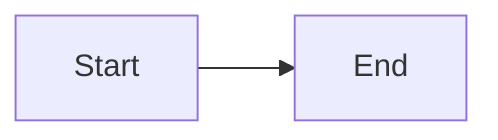

# Honeymelon Documentation

This directory contains the complete documentation for Honeymelon, built with [VitePress](https://vitepress.dev/).

## Structure

```
docs/
├── .vitepress/              # VitePress configuration
│   ├── config.ts           # Site configuration
│   └── theme/              # Custom theme (if needed)
├── public/                  # Static assets
│   └── logo.svg            # Site logo
├── index.md                 # Homepage
├── changelog.md             # Version history
│
├── guide/                   # User guides
│   ├── what-is-honeymelon.md
│   ├── getting-started.md
│   ├── converting-files.md
│   ├── presets.md
│   ├── batch-processing.md
│   ├── preferences.md
│   ├── supported-formats.md
│   └── troubleshooting.md
│
├── architecture/            # Technical architecture
│   ├── overview.md
│   ├── pipeline.md
│   ├── ffmpeg.md
│   ├── state.md
│   └── tech-stack.md
│
├── development/             # Development guides
│   ├── contributing.md
│   ├── building.md
│   ├── testing.md
│   ├── agents.md
│   └── claude.md
│
└── legal/                   # Legal documentation
    ├── license-compliance.md
    ├── commercial-license.md
    └── third-party-notices.md
```

## Development

### Prerequisites

- Node.js 18+
- npm or pnpm

### Commands

```bash
# Start development server
npm run docs:dev

# Build for production
npm run docs:build

# Preview production build
npm run docs:preview
```

### Development Server

The docs will be available at `http://localhost:5173/`

### Features

- ✅ Comprehensive user guides
- ✅ Detailed architecture documentation
- ✅ Development and contribution guides
- ✅ Legal and compliance information
- ✅ Full-text search (built-in)
- ✅ Responsive design
- ✅ Dark mode support
- ✅ Markdown support with extensions
- ✅ Mermaid diagrams
- ✅ Code syntax highlighting

## Writing Documentation

### Markdown Features

VitePress supports GitHub-flavored Markdown plus additional features:

#### Custom Containers

```markdown
::: tip
Helpful tip for users
:::

::: warning
Important warning
:::

::: danger
Critical information
:::

::: info
General information
:::
```

#### Code Groups

`````markdown
::: code-group

````bash [npm]
npm install
\```

```bash [pnpm]
pnpm install
\```
:::
````
`````

#### Mermaid Diagrams

````markdown

````

### Adding a New Page

1. Create a new `.md` file in the appropriate directory
2. Add frontmatter (optional):
   ```markdown
   ---
   title: Page Title
   description: Page description
   ---
   ```
3. Write content in Markdown
4. Update sidebar configuration in `.vitepress/config.ts`

### Linking Between Pages

Use relative paths:

```markdown
[Getting Started](./getting-started.md)
[Architecture](/architecture/overview.md)
```

## Deployment

### Build

```bash
npm run docs:build
```

Output will be in `docs/.vitepress/dist/`

### Hosting Options

- **GitHub Pages**: Deploy from `dist/` directory
- **Netlify**: Auto-deploy from repo
- **Vercel**: Auto-deploy from repo
- **Cloudflare Pages**: Auto-deploy from repo

### Custom Domain

Configure in `.vitepress/config.ts`:

```typescript
export default {
  base: '/', // For root domain
  // or
  base: '/honeymelon/', // For subdirectory
};
```

## Configuration

Main configuration file: [.vitepress/config.ts](.vitepress/config.ts)

Key settings:

- **title**: Site title
- **description**: Site description
- **themeConfig**: Theme configuration
  - **nav**: Top navigation
  - **sidebar**: Sidebar navigation
  - **socialLinks**: Social media links
  - **search**: Search configuration
  - **footer**: Footer content

## Maintenance

### Keeping Documentation Updated

- Update changelog when releasing new versions
- Add new features to relevant guide pages
- Keep architecture docs in sync with code
- Update troubleshooting guide with common issues

### Checking Links

```bash
# Check for broken links
npx vitepress check-links docs
```

### Spell Checking

Use a markdown spell checker extension in your editor.

## Contributing

See [Contributing Guide](./development/contributing.md) for information on how to contribute to the documentation.

## Questions?

For questions about the documentation:

- Open an issue on GitHub
- Email: tjthavarshan@gmail.com
