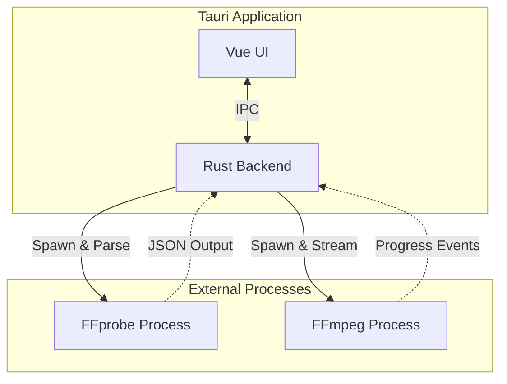
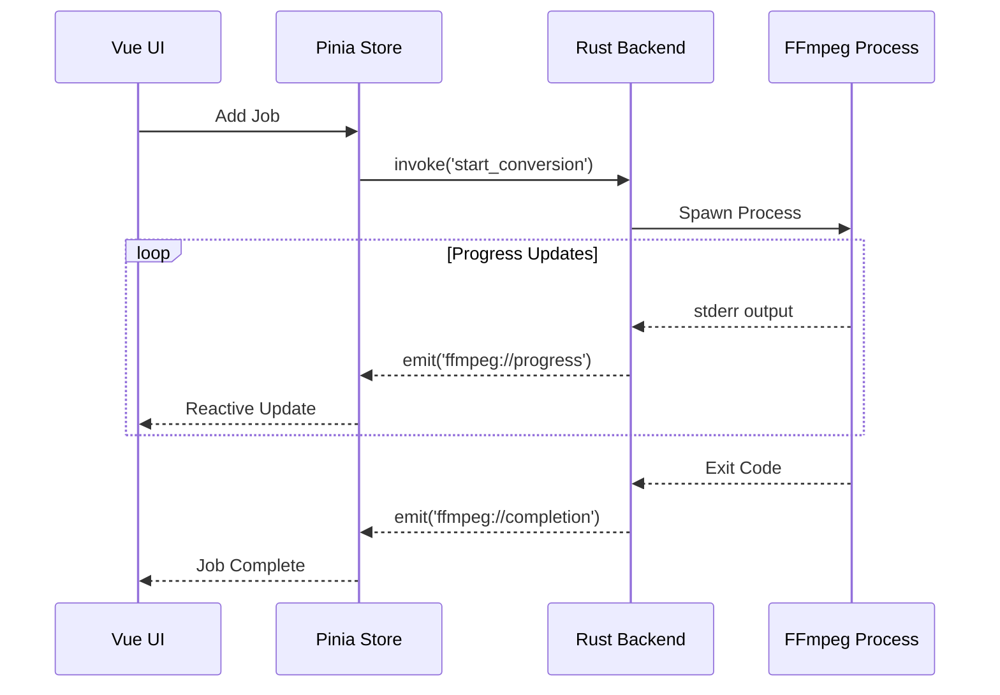
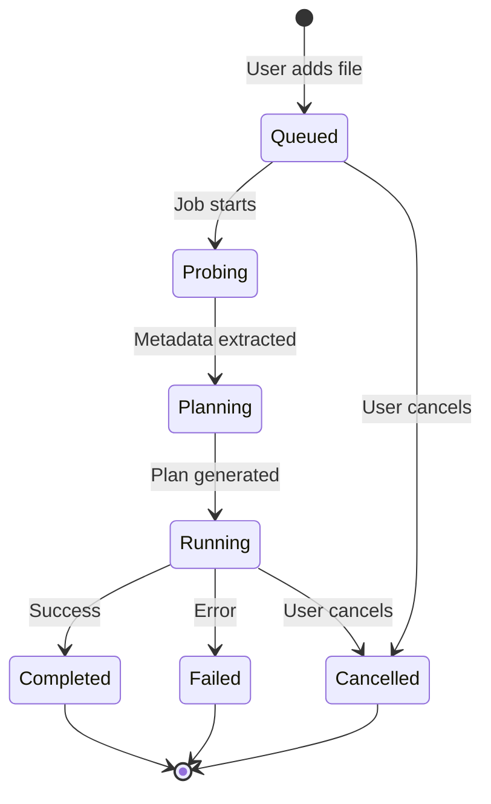
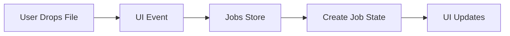
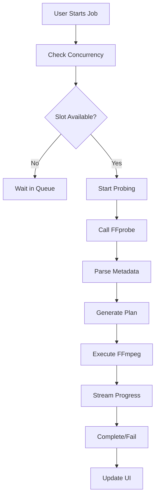

# Architecture Overview

Honeymelon is built with modern web and native technologies, combining the flexibility of web development with the performance and integration of native applications.

## Technology Stack

### Frontend Layer

**Framework**: Vue 3 with Composition API

- `<script setup>` syntax for concise components
- TypeScript for type safety
- Vite for fast development and optimized production builds

**State Management**: Pinia + shared services

- Reactive stores for application state
- Discriminated union types for type-safe state transitions enforced by `src/lib/job-lifecycle.ts`
- Job queue split across focused stores (`job-queue`, `job-state`, `job-progress`, `job-logs`) backed by `job-service`
- Separate stores for preferences and desktop integration metadata

**UI Components**: shadcn-vue

- Built on Reka UI primitives
- Styled with Tailwind CSS 4
- Accessible, customizable components

**Additional Libraries**:

- `lucide-vue-next` - Icon system
- `vee-validate` + `zod` - Form validation
- `vue-sonner` - Toast notifications
- `@tanstack/vue-table` - Data tables
- `@vueuse/core` - Composition utilities

### Backend Layer

**Framework**: Tauri 2

- Native desktop integration via Rust
- IPC (Inter-Process Communication) bridge between frontend and backend
- WebView-based UI rendering

**Language**: Rust (Edition 2021)

- Memory safety without garbage collection
- Async/await with Tokio runtime
- Strong type system

**Key Rust Crates**:

- `serde`/`serde_json` - Serialization
- `tokio` - Async runtime
- `once_cell` - Lazy statics
- `rfd` - Native file dialogs

### External Tools

**FFmpeg**:

- Out-of-process execution
- Spawned as separate system processes
- Communication via stdin/stdout/stderr
- LGPL compliant (no linking)

**FFprobe**:

- Media file analysis
- JSON output parsing
- Metadata extraction

## Architectural Patterns

### Process Separation



**Benefits**:

1. **LGPL Compliance**: No static or dynamic linking to FFmpeg
2. **Process Isolation**: FFmpeg crashes don't affect the app
3. **Resource Management**: Each job runs in its own process
4. **Flexibility**: Easy to swap FFmpeg versions

### Event-Driven Architecture



**Key Events**:

- `ffmpeg://progress` - Encoding progress updates
- `ffmpeg://completion` - Job finished (success/failure)
- `ffmpeg://stderr` - Raw FFmpeg output for logs

### State Machine Pattern

Jobs progress through well-defined states:



Each state has specific data associated with it (discriminated unions) and transitions are centrally enforced by `jobLifecycle.ensureTransition` on the frontend plus the mirrored guard in `src-tauri/src/job_lifecycle.rs`.

## Directory Structure

```

honeymelon/
├── src/                          # Vue frontend
│   ├── app.vue                   # Root component
│   ├── main.ts                   # Entry point
│   │
│   ├── lib/                      # Core business logic
│   │   ├── ffmpeg-probe.ts       # FFprobe wrapper
│   │   ├── ffmpeg-plan.ts        # Conversion planning
│   │   ├── container-rules.ts    # Codec compatibility
│   │   ├── presets.ts            # Dynamic preset generation
│   │   ├── capability.ts         # Encoder detection
│   │   ├── job-lifecycle.ts      # Canonical job state transitions
│   │   └── types.ts              # TypeScript definitions
│   │
│   ├── services/                 # Shared service layer
│   │   └── job-service.ts        # Repository proxy + duplicate detection
│   │
│   ├── stores/                   # Pinia stores
│   │   ├── job-queue.ts          # Queue operations & concurrency tracking
│   │   ├── job-state.ts          # Lifecycle mutations validated by job-lifecycle
│   │   ├── job-progress.ts       # Progress metrics + ETA helpers
│   │   ├── job-logs.ts           # Circular buffer per job
│   │   └── prefs.ts              # User preferences
│   │
│   ├── composables/              # Vue composables
│   │   ├── use-app-orchestration.ts # Bridges UI events into queue orchestration
│   │   ├── use-capability-gate.ts  # Capability snapshot loading + preset readiness
│   │   ├── use-desktop-bridge.ts   # Drag/drop + menu integration
│   │   ├── use-job-orchestrator.ts # Coordinates planner/runner clients
│   │   └── orchestrator/           # Planner/runner clients + event subscriber
│   │
│   └── components/               # Vue components
│       ├── JobQueueItem.vue      # Individual job card
│       ├── AboutDialog.vue       # About modal
│       ├── PreferencesDialog.vue # Settings
│       └── ui/                   # shadcn-vue components
│
├── src-tauri/                    # Rust backend
│   ├── src/
│   │   ├── lib.rs                # Command wiring + menu/IPC registration
│   │   ├── commands/             # Domain-specific Tauri commands (jobs, filesystem, license, dialogs)
│   │   ├── ffmpeg_probe.rs       # FFprobe spawning
│   │   ├── runner/               # Coordinator, registry, validator, and process spawner modules
│   │   ├── job_lifecycle.rs      # Rust mirror of frontend lifecycle guard
│   │   ├── ffmpeg_capabilities.rs # Encoder detection
│   │   ├── services/             # Backend services (license, telemetry, filesystem)
│   │   ├── fs_utils.rs           # File operations
│   │   └── error.rs              # Error handling
│   │
│   ├── tauri.conf.json          # Tauri configuration
│   └── Cargo.toml               # Rust dependencies
│
├── docs/                         # VitePress documentation
├── e2e/                          # Playwright tests
├── public/                       # Static assets served as-is
└── src-tauri/bin/                # Bundled FFmpeg binaries (ffmpeg/ffprobe)

```

## Data Flow

### Adding a File



### Converting a File



## Communication Layers

### Frontend ↔ Backend (Tauri IPC)

**Command Pattern** (Frontend → Backend):

```typescript
// Frontend
import { invoke } from '@tauri-apps/api/core';

const result = await invoke('probe_media', {
  filePath: '/path/to/video.mp4',
});
```

```rust
// Backend
#[tauri::command]
async fn probe_media(file_path: String) -> Result<ProbeResult, String> {
    // Execute FFprobe and return results
}

```

**Event Pattern** (Backend → Frontend):

```rust
// Backend emits event
app.emit("ffmpeg://progress", ProgressPayload { ... })?;

```

```typescript
// Frontend listens
import { listen } from '@tauri-apps/api/event';

listen('ffmpeg://progress', (event) => {
  console.log('Progress:', event.payload);
});
```

### Backend ↔ FFmpeg (Process Spawning)

```rust
use std::process::{Command, Stdio};

let mut child = Command::new("ffmpeg")
    .args(&ffmpeg_args)
    .stdin(Stdio::null())
    .stdout(Stdio::piped())
    .stderr(Stdio::piped())
    .spawn()?;

// Read stderr for progress
let stderr = child.stderr.take().unwrap();
let reader = BufReader::new(stderr);

for line in reader.lines() {
    // Parse progress and emit events
}

```

## Type Safety

### Frontend Types

```typescript
type JobState =
  | { status: 'queued'; sourceFile: string; presetId: string; tier: QualityTier }
  | { status: 'probing'; probeStartedAt: number }
  | { status: 'planning'; probe: ProbeSummary }
  | { status: 'running'; progress: number; fps?: number; etaSeconds?: number }
  | { status: 'completed'; outputFile: string; durationMs: number }
  | { status: 'failed'; error: string; logs: string[] }
  | { status: 'cancelled'; reason?: string };

interface JobRecord {
  id: string;
  state: JobState;
  exclusive: boolean;
  updatedAt: number;
  logs: string[];
}
```

### Backend Types

```rust
// Serde-serializable types for IPC
#[derive(Serialize, Deserialize)]
struct ProbeResult {
    duration: f64,
    video_codec: Option<String>,
    audio_codec: Option<String>,
    width: u32,
    height: u32,
}

```

### Type Consistency

Rust types are serialized to JSON and deserialized in TypeScript, maintaining type safety across the IPC boundary.

## Performance Optimizations

### Reactive Updates

- Vue's reactivity system ensures efficient UI updates
- Only changed components re-render
- Computed properties cache derived state

### Async Processing

- Tokio runtime handles concurrent FFmpeg processes
- Non-blocking I/O for progress streaming
- Efficient resource utilization

### Process Management

- Concurrency limits prevent resource exhaustion
- Queue system ensures orderly processing
- Process cleanup on cancellation

## Security Considerations

### Process Isolation

- FFmpeg runs in separate processes with limited privileges
- No access to app internals
- Crashes contained to individual jobs

### File Access

- macOS sandbox enforces file access restrictions
- User must grant permissions via native dialogs
- No unauthorized file access

### Input Validation

- All file paths validated before use
- FFmpeg arguments sanitized
- User input validated with Zod schemas

## Testing Strategy

### Frontend Tests (Vitest)

- Suites cover planners, presets, job services, orchestrator clients, and Pinia stores
- Shared teardown helper ensures mocked Tauri listeners are cleaned between specs
- Coverage thresholds enforced in CI via `npm run test:unit:coverage`

### Backend Tests (Cargo Test)

- 108 Rust unit tests
- Integration tests for FFmpeg interaction
- Error handling tests

### E2E Tests (Playwright)

- Full workflow testing
- UI interaction testing
- Cross-platform compatibility

## Build & Deployment

### Development

```bash
npm run tauri:dev

```

- Hot module replacement (HMR) for Vue
- Rust recompilation on change
- Fast feedback loop

### Production

```bash
npm run tauri:build
```

- Vue optimized with Vite
- Rust compiled with optimizations
- DMG/app bundle creation
- Code signing (if configured)

## Next Steps

- Understand the [Conversion Pipeline](/architecture/pipeline) in detail
- Learn about [FFmpeg Integration](/architecture/ffmpeg)
- Explore [State Management](/architecture/state) patterns
- Review the [Tech Stack](/architecture/tech-stack) choices
