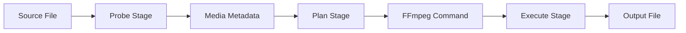

# Conversion Pipeline

The conversion pipeline is the heart of Honeymelon, transforming user intent into optimized FFmpeg commands. It consists of three sequential stages: **Probe**, **Plan**, and **Execute**.

## Pipeline Overview



Each stage has specific responsibilities and can fail independently, allowing for precise error handling and reporting.

## Stage 1: Probe

**Purpose**: Extract comprehensive metadata from the source file using FFprobe.

### Probe: Implementation

**Location**: [src/lib/ffmpeg-probe.ts](https://github.com/honeymelon-app/honeymelon/blob/main/src/lib/ffmpeg-probe.ts) (frontend) and [src-tauri/src/ffmpeg_probe.rs](https://github.com/honeymelon-app/honeymelon/blob/main/src-tauri/src/ffmpeg_probe.rs) (backend)

**Process**:

1. Frontend invokes Tauri command `probe_media`
1. Rust spawns FFprobe process:

   ```rust
   ffprobe -v quiet -print_format json -show_format -show_streams input.mp4
   ```

1. Parse JSON output to extract metadata
1. Return structured data to frontend

### Extracted Metadata

```typescript
interface ProbeResult {
  duration: number; // Total duration in seconds
  size: number; // File size in bytes
  bitrate: number; // Overall bitrate

  // Video stream
  videoCodec?: string; // e.g., "h264", "hevc", "vp9"
  width?: number; // Video width in pixels
  height?: number; // Video height in pixels
  fps?: number; // Frame rate
  videoBitrate?: number; // Video stream bitrate
  pixelFormat?: string; // e.g., "yuv420p"
  colorSpace?: string; // e.g., "bt709"
  colorPrimaries?: string;
  colorTransfer?: string;

  // Audio stream
  audioCodec?: string; // e.g., "aac", "opus", "mp3"
  audioChannels?: number; // Number of audio channels
  audioSampleRate?: number; // Sample rate in Hz
  audioBitrate?: number; // Audio stream bitrate
}
```

### Error Handling

Common probe errors:

- **File not found**: Invalid path
- **Corrupted file**: FFprobe cannot parse
- **Unsupported format**: No valid streams detected
- **Permission denied**: Insufficient file access

Each error is caught and reported with a user-friendly message.

## Stage 2: Plan

**Purpose**: Determine the optimal conversion strategy based on probe results, selected preset, and quality tier.

### Plan: Implementation

**Location**: [src/lib/ffmpeg-plan.ts](../../src/lib/ffmpeg-plan.ts) with planner/runner clients in `src/composables/orchestrator/`

**Process**:

```typescript
function generatePlan(probe: ProbeResult, preset: Preset, quality: QualityTier): FFmpegPlan;
```

### Container Compatibility Rules

**Location**: [src/lib/container-rules.ts](../../src/lib/container-rules.ts)

Defines which codecs are compatible with which containers:

```typescript
const MP4_RULES = {
  video: ['h264', 'hevc'],
  audio: ['aac', 'mp3'],
};

const MKV_RULES = {
  video: ['h264', 'hevc', 'vp9', 'av1', 'prores'],
  audio: ['aac', 'opus', 'flac', 'mp3', 'pcm'],
};

const WEBM_RULES = {
  video: ['vp8', 'vp9', 'av1'],
  audio: ['opus', 'vorbis'],
};
```

### Stream Action Determination

For each stream (video, audio), the planner determines one of three actions:

#### Copy (Remux)

**Condition**: Source codec is compatible with target container

```typescript
if (probe.videoCodec === 'h264' && targetContainer === 'mp4') {
  videoAction = 'copy';
}
```

**FFmpeg Argument**: `-c:v copy`

**Benefits**:

- Extremely fast (500-1000+ fps)
- Zero quality loss
- Minimal resource usage

#### Transcode

**Condition**: Codec incompatible or quality tier requires it

```typescript
if (probe.videoCodec === 'vp9' && targetContainer === 'mp4') {
  videoAction = 'transcode';
  videoCodec = 'h264';
}
```

**FFmpeg Arguments** (example):

```bash
-c:v libx264 -preset medium -crf 23

```

**Parameters based on quality tier**:

| Tier     | CRF | Preset | Bitrate   |
| -------- | --- | ------ | --------- |
| Fast     | 23  | fast   | N/A (CRF) |
| Balanced | 23  | medium | N/A (CRF) |
| High     | 18  | slow   | N/A (CRF) |

#### Drop

**Condition**: Stream not supported or unwanted

```typescript
if (probe.subtitleStreams && !preset.includeSubtitles) {
  subtitleAction = 'drop';
}
```

**FFmpeg Argument**: `-sn` (no subtitles)

### Plan Output

```typescript
interface FFmpegPlan {
  videoAction: 'copy' | 'transcode' | 'drop';
  videoCodec?: string;
  videoOptions?: string[];

  audioAction: 'copy' | 'transcode' | 'drop';
  audioCodec?: string;
  audioOptions?: string[];

  containerOptions?: string[];
  estimatedSpeed: 'fast' | 'moderate' | 'slow';
}
```

### Example Plans

#### Example 1: Remux MKV → MP4

```text
Input: video.mkv (H.264 + AAC)
Preset: video-to-mp4
Quality: Fast

Plan:
  Video: H.264 → Copy (compatible)
  Audio: AAC → Copy (compatible)
  Estimated Speed: Fast (remux)

FFmpeg Command:
  ffmpeg -i video.mkv -c:v copy -c:a copy output.mp4

```

#### Example 2: Transcode MKV → MP4

```text
Input: video.mkv (VP9 + Opus)
Preset: video-to-mp4
Quality: Balanced

Plan:
  Video: VP9 → Transcode to H.264 (incompatible)
  Audio: Opus → Transcode to AAC (incompatible)
  Estimated Speed: Moderate (transcode)

FFmpeg Command:
  ffmpeg -i video.mkv \
    -c:v libx264 -preset medium -crf 23 \
    -c:a aac -b:a 192k \
    output.mp4

```

#### Example 3: High Quality Archive

```text
Input: video.mov (ProRes + PCM)
Preset: video-to-mkv
Quality: High

Plan:
  Video: ProRes → Transcode to H.265 (user wants compression)
  Audio: PCM → Transcode to FLAC (lossless compression)
  Estimated Speed: Slow (high quality encode)

FFmpeg Command:
  ffmpeg -i video.mov \
    -c:v libx265 -preset slow -crf 18 \
    -c:a flac \
    output.mkv

```

## Stage 3: Execute

**Purpose**: Run FFmpeg with the generated plan and monitor progress.

### Execute: Implementation

**Location**: runner modules under `src-tauri/src/runner` (backend) and frontend orchestration stack (`use-job-orchestrator.ts`, `orchestrator/planner-client.ts`, `orchestrator/runner-client.ts`, `orchestrator/event-subscriber.ts`)

### Process

1. **Validate Job**: Check concurrency limits
2. **Resolve FFmpeg Path**: Find FFmpeg binary
3. **Build Command**: Construct complete FFmpeg command
4. **Spawn Process**: Start FFmpeg as child process
5. **Stream Progress**: Parse stderr for progress updates
6. **Handle Completion**: Process exit code and finalize

### Progress Parsing

FFmpeg outputs progress to stderr:

```text
frame= 150 fps= 30 q=28.0 size= 1024kB time=00:00:05.00 bitrate=1677.7kbits/s speed=1.0x

```

**Parsed Fields**:

- `frame`: Current frame number
- `fps`: Encoding speed (frames per second)
- `time`: Current position in media file
- `speed`: Encoding speed relative to playback

**Progress Calculation**:

```rust
let percentage = (current_time / total_duration) * 100.0;
let eta = (total_duration - current_time) / speed;

```

### Event Emission

As FFmpeg runs, the backend emits events to the frontend:

```rust
app.emit("ffmpeg://progress", ProgressPayload {
    job_id: job.id.clone(),
    frame: 150,
    fps: 30.0,
    percentage: 25.0,
    eta_seconds: 15.0,
    speed: "1.0x".to_string(),
})?;

```

Frontend listens and updates UI:

```typescript
listen<ProgressPayload>('ffmpeg://progress', (event) => {
  const job = findJob(event.payload.job_id);
  job.progress = event.payload.percentage;
  job.fps = event.payload.fps;
  job.eta = event.payload.eta_seconds;
});
```

### Completion Handling

FFmpeg exits with a status code:

- **0**: Success
- **Non-zero**: Error occurred

**Success Path**:

1. Verify output file exists
2. Atomic move to final location (prevents partial files)
3. Emit `ffmpeg://completion` event
4. Update job state to `completed`

**Error Path**:

1. Capture stderr output (error message)
2. Clean up partial output file
3. Emit `ffmpeg://completion` with error
4. Update job state to `failed` with error message

### Cancellation

User can cancel a running job:

1. Frontend sends cancel request
2. Backend kills FFmpeg process (`SIGTERM`)
3. Clean up partial output file
4. Update job state to `cancelled`

## Pipeline Optimizations

### Hardware Acceleration

When encoding H.264/H.265 on Apple Silicon:

```bash
# Software encoder (slower, higher quality)
-c:v libx264

# Hardware encoder (faster, good quality)
-c:v h264_videotoolbox

```

Automatically selected based on:

- Processor type (Apple Silicon)
- Target codec (H.264 or H.265)
- User preference (can be disabled)

### Two-Pass Encoding (Future Feature)

For optimal bitrate control:

**Pass 1**: Analyze video

```bash
ffmpeg -i input.mp4 -c:v libx264 -b:v 2M -pass 1 -f null /dev/null

```

**Pass 2**: Encode with analysis

```bash
ffmpeg -i input.mp4 -c:v libx264 -b:v 2M -pass 2 output.mp4
```

### Quality Presets

FFmpeg's `-preset` option balances speed vs. compression:

| Preset    | Encode Speed | File Size | Quality   |
| --------- | ------------ | --------- | --------- |
| ultrafast | Fastest      | Largest   | Lowest    |
| fast      | Fast         | Large     | Good      |
| medium    | Moderate     | Medium    | Good      |
| slow      | Slow         | Small     | Excellent |
| veryslow  | Very Slow    | Smallest  | Best      |

Honeymelon uses:

- **Fast tier**: `fast`
- **Balanced tier**: `medium`
- **High tier**: `slow`

## Error Recovery

### Retryable Errors

Some errors can be automatically retried:

- **Temporary resource issues**: Wait and retry
- **FFmpeg timeout**: Increase timeout and retry
- **Disk space (momentary)**: Wait for space, retry

### Non-Retryable Errors

Some errors require user intervention:

- **Corrupted file**: Cannot be fixed automatically
- **Insufficient permissions**: User must grant access
- **Unsupported codec**: Cannot be encoded

## Performance Metrics

Typical performance by operation:

| Operation | FPS       | Real-Time Speed | Use Case         |
| --------- | --------- | --------------- | ---------------- |
| Remux     | 500-1000+ | 20-40x          | Format change    |
| H.264 HW  | 60-150    | 2-6x            | Fast encode      |
| H.265 HW  | 30-80     | 1-3x            | Efficient encode |
| H.264 SW  | 20-60     | 0.8-2x          | Quality encode   |
| H.265 SW  | 5-25      | 0.2-1x          | High quality     |
| VP9       | 3-10      | 0.1-0.4x        | Web streaming    |
| AV1       | 1-5       | 0.04-0.2x       | Next-gen web     |

### FPS values for 1080p content on M1 Mac

## Next Steps

- Understand [FFmpeg Integration](/architecture/ffmpeg) details
- Explore [State Management](/architecture/state) for job tracking
- Review [Tech Stack](/architecture/tech-stack) choices
