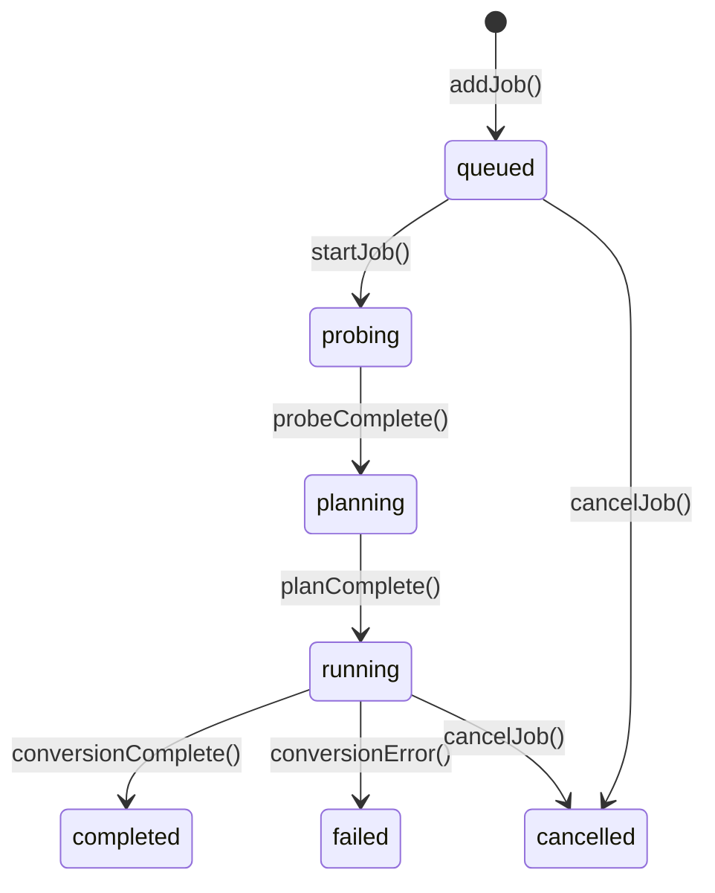

# State Management

Honeymelon uses Pinia for reactive state management with discriminated union types for type-safe state transitions. This document explains the state architecture and patterns used throughout the application.

## Pinia Stores

### Jobs Store

**Location**: `src/stores/` — split into `job-queue.ts`, `job-state.ts`, `job-progress.ts`, `job-logs.ts`, with a facade `jobs.ts` that composes them.

Manages the conversion job queue and job lifecycle. The public API is exposed via the `useJobsStore()` facade which composes the focused composables.

```typescript
// Usage (facade):
const jobs = useJobsStore();

// Enqueue a file
const id = jobs.enqueue('/path/to/file.mp4', 'preset-id', 'balanced');

// Start next job (facade delegates to underlying composables)
jobs.startNext();

// Subscribe to progress via computed store values
const running = jobs.activeJobs;
```

### Preferences Store

**Location**: `src/stores/prefs.ts` (uses a persistent store via `tauri-plugin-store` on desktop builds, and falls back to in-memory/localStorage in non-Tauri environments for tests)

Manages user preferences and application settings. The implementation persists preferences using the Tauri `Store` API (file-backed) when running as a desktop app.

```typescript
// Example usage inside a composable
import { Store } from '@tauri-apps/plugin-store';

const store = new Store('.settings.dat');

export function usePrefs() {
  const outputDirectory = ref<string | null>(null);

  async function load() {
    const stored = await store.get('prefs');
    if (stored) {
      outputDirectory.value = stored.outputDirectory ?? null;
      // ... load other prefs
    }
  }

  async function save() {
    await store.set('prefs', {
      outputDirectory: outputDirectory.value,
      // ... other prefs
    });
    await store.save();
  }

  return { outputDirectory, load, save };
}
```

## Job State Machine

### Discriminated Union Types

Jobs use discriminated unions for type-safe state management:

```typescript
type Job =
  | QueuedJob
  | ProbingJob
  | PlanningJob
  | RunningJob
  | CompletedJob
  | FailedJob
  | CancelledJob;

interface QueuedJob {
  status: 'queued';
  id: string;
  sourceFile: string;
  preset: Preset;
  quality: QualityTier;
}

interface ProbingJob {
  status: 'probing';
  id: string;
  sourceFile: string;
  preset: Preset;
  quality: QualityTier;
}

interface RunningJob {
  status: 'running';
  id: string;
  sourceFile: string;
  outputFile: string;
  progress: number; // 0-100
  fps: number;
  frame: number;
  etaSeconds: number;
  speed: string; // e.g., "2.5x"
  logs: string[];
}

interface CompletedJob {
  status: 'completed';
  id: string;
  sourceFile: string;
  outputFile: string;
  duration: number; // Total time in seconds
}

interface FailedJob {
  status: 'failed';
  id: string;
  sourceFile: string;
  error: string;
  logs: string[];
}
```

### State Transitions



### Type-Safe Updates

TypeScript ensures only valid transitions:

```typescript
function updateJob(jobId: string, updates: Partial<Job>) {
  const index = jobs.value.findIndex((j) => j.id === jobId);
  if (index === -1) return;

  const currentJob = jobs.value[index];

  // Type guard ensures valid state transition
  if (currentJob.status === 'queued' && updates.status === 'probing') {
    jobs.value[index] = {
      ...currentJob,
      status: 'probing',
    };
  } else if (currentJob.status === 'probing' && updates.status === 'planning') {
    jobs.value[index] = {
      ...currentJob,
      status: 'planning',
      probe: updates.probe, // Only available in planning state
    };
  }
  // ... more transitions
}
```

This prevents invalid transitions like `queued → completed`.

## Reactive Patterns

### Computed Properties

Derive state from the store:

```typescript
const runningJobs = computed(() => jobs.value.filter((j) => j.status === 'running'));

const queuedJobs = computed(() => jobs.value.filter((j) => j.status === 'queued'));

const completedCount = computed(() => jobs.value.filter((j) => j.status === 'completed').length);

const totalProgress = computed(() => {
  const running = runningJobs.value;
  if (running.length === 0) return 0;

  const sum = running.reduce((acc, job) => acc + job.progress, 0);
  return sum / running.length;
});
```

### Watchers

React to state changes:

```typescript
watch(
  () => runningJobs.value.length,
  (newCount, oldCount) => {
    if (newCount < concurrencyLimit.value) {
      // Start next queued job
      startNextJob();
    }
  },
);

watch(
  () => prefs.concurrentJobs,
  (newLimit) => {
    // Adjust concurrency
    adjustConcurrency(newLimit);
  },
);
```

## Job Orchestration

### Composable

**Location**: [src/composables/use-job-orchestrator.ts](../../src/composables/use-job-orchestrator.ts)

Coordinates job lifecycle and event handling:

```typescript
export function useJobOrchestrator() {
  const jobsStore = useJobsStore();
  const prefsStore = usePrefsStore();

  // Listen for FFmpeg events
  onMounted(() => {
    listen('ffmpeg://progress', handleProgress);
    listen('ffmpeg://completion', handleCompletion);
    listen('ffmpeg://error', handleError);
  });

  function handleProgress(event: Event<ProgressPayload>) {
    const { job_id, percentage, fps, eta_seconds } = event.payload;
    jobsStore.updateJobProgress(job_id, { percentage, fps, eta_seconds });
  }

  function handleCompletion(event: Event<CompletionPayload>) {
    const { job_id, success, output_path } = event.payload;
    if (success) {
      jobsStore.completeJob(job_id, output_path);
      startNextJob(); // Start next queued job
    } else {
      jobsStore.failJob(job_id, event.payload.error);
    }
  }

  async function startNextJob() {
    const queuedJobs = jobsStore.jobs.filter((j) => j.status === 'queued');
    const runningCount = jobsStore.jobs.filter((j) => j.status === 'running').length;

    if (queuedJobs.length > 0 && runningCount < prefsStore.concurrentJobs) {
      await jobsStore.startJob(queuedJobs[0].id);
    }
  }

  return { startNextJob };
}
```

## Persistence

### Preferences Persistence

Preferences are persisted to local storage:

```typescript
// Save preferences
function savePreferences() {
  const prefs = {
    outputDirectory: outputDirectory.value,
    filenameSuffix: filenameSuffix.value,
    concurrentJobs: concurrentJobs.value,
    defaultQuality: defaultQuality.value,
    hwAccelEnabled: hwAccelEnabled.value,
  };

  localStorage.setItem('honeymelon-prefs', JSON.stringify(prefs));
}

// Load preferences
function loadPreferences() {
  const stored = localStorage.getItem('honeymelon-prefs');
  if (!stored) return;

  const prefs = JSON.parse(stored);
  outputDirectory.value = prefs.outputDirectory;
  filenameSuffix.value = prefs.filenameSuffix;
  // ... load other fields
}
```

### Job State Persistence (Future Feature)

Future versions will persist job queue:

- Resume interrupted conversions
- Restore queue on app restart
- Scheduled/deferred processing

## Performance Optimizations

### Shallow Reactivity

For large job arrays, use shallow refs:

```typescript
const jobs = shallowRef<Job[]>([]);

// Update requires full replacement
jobs.value = [...jobs.value, newJob];
```

### Debounced Updates

Throttle frequent updates:

```typescript
import { useDebounceFn } from '@vueuse/core';

const debouncedUpdateProgress = useDebounceFn((jobId, progress) => {
  updateJobProgress(jobId, progress);
}, 100); // Update UI at most every 100ms
```

### Batch Operations

Process multiple jobs efficiently:

```typescript
function cancelAllJobs() {
  const toCancel = jobs.value.filter((j) => j.status === 'queued' || j.status === 'running');

  // Batch cancel
  toCancel.forEach((job) => {
    if (job.status === 'running') {
      invoke('cancel_ffmpeg', { jobId: job.id });
    }
  });

  // Single reactive update
  jobs.value = jobs.value.map((job) =>
    toCancel.includes(job) ? { ...job, status: 'cancelled' } : job,
  );
}
```

## Testing State Management

### Unit Tests

**Location**: [src/stores/**tests**/jobs.spec.ts](../../src/stores/__tests__/jobs.spec.ts)

```typescript
import { setActivePinia, createPinia } from 'pinia';
import { useJobsStore } from '../jobs';

describe('Jobs Store', () => {
  beforeEach(() => {
    setActivePinia(createPinia());
  });

  it('adds a job to the queue', () => {
    const store = useJobsStore();
    store.addJob('/path/to/file.mp4', 'video-to-mp4', 'balanced');

    expect(store.jobs).toHaveLength(1);
    expect(store.jobs[0].status).toBe('queued');
  });

  it('transitions job from queued to probing', async () => {
    const store = useJobsStore();
    store.addJob('/path/to/file.mp4', 'video-to-mp4', 'balanced');

    await store.startJob(store.jobs[0].id);

    expect(store.jobs[0].status).toBe('probing');
  });

  it('respects concurrency limit', async () => {
    const store = useJobsStore();
    store.concurrencyLimit = 2;

    // Add 3 jobs
    store.addJob('/file1.mp4', 'video-to-mp4', 'balanced');
    store.addJob('/file2.mp4', 'video-to-mp4', 'balanced');
    store.addJob('/file3.mp4', 'video-to-mp4', 'balanced');

    // Start all
    await Promise.all(store.jobs.map((j) => store.startJob(j.id)));

    // Only 2 should be running
    const running = store.jobs.filter((j) => j.status === 'running');
    expect(running).toHaveLength(2);
  });
});
```

## Best Practices

### 1. Immutable Updates

Always create new objects/arrays:

```typescript
// Bad
job.progress = 50;

// Good
jobs.value = jobs.value.map((j) => (j.id === jobId ? { ...j, progress: 50 } : j));
```

### 2. Centralized State

All state lives in stores, not components:

```typescript
// Bad: Local component state
const jobs = ref([]);

// Good: Pinia store
const jobsStore = useJobsStore();
const jobs = jobsStore.jobs;
```

### 3. Computed Derived State

Don't duplicate state:

```typescript
// Bad: Duplicate state
const completedCount = ref(0);

// Good: Computed from source
const completedCount = computed(() => jobs.value.filter((j) => j.status === 'completed').length);
```

### 4. Actions for Mutations

Use store actions, not direct mutations:

```typescript
// Bad: Direct mutation
store.jobs.push(newJob);

// Good: Action
store.addJob(newJob);
```

## Next Steps

- Review the [Tech Stack](/architecture/tech-stack) choices
- Understand the [Conversion Pipeline](/architecture/pipeline)
- Explore [FFmpeg Integration](/architecture/ffmpeg) details
