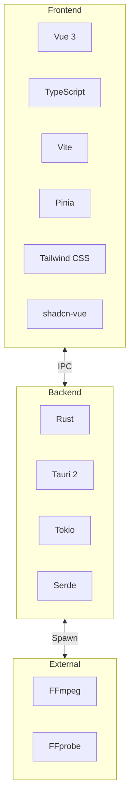

# Tech Stack

This document explains the technology choices for Honeymelon and the rationale behind them.

## Overview

Honeymelon combines modern web technologies with native platform capabilities to deliver a performant, maintainable desktop application.



## Frontend Stack

### Vue 3

**Why Vue?**

- **Composition API**: Clean, reusable logic with composables
- **Reactive System**: Efficient updates with minimal boilerplate
- **TypeScript Support**: First-class TypeScript integration
- **Performance**: Fast virtual DOM with compiler optimizations
- **Ecosystem**: Rich component libraries and tooling

**Alternatives Considered**:

- React: More verbose, requires more boilerplate
- Svelte: Less mature ecosystem, smaller community
- Solid: Too new, limited library support

**Usage**:

```vue
<script setup lang="ts">
import { ref, computed } from 'vue';

const count = ref(0);
const doubled = computed(() => count.value * 2);
</script>
```

### TypeScript

**Why TypeScript?**

- **Type Safety**: Catch errors at compile time
- **Better IDE Support**: Autocomplete, refactoring
- **Self-Documenting**: Types serve as inline documentation
- **Refactoring Confidence**: Safe large-scale changes
- **Interop with Rust**: Type consistency across IPC

**Configuration**: Strict mode enabled (`strict: true`)

**Usage**:

```typescript
interface Job {
  id: string;
  status: 'queued' | 'running' | 'completed';
  progress: number;
}

function updateJob(job: Job, progress: number): Job {
  return { ...job, progress };
}
```

### Vite

**Why Vite?**

- **Fast HMR**: Instant updates during development
- **Optimized Builds**: Efficient production bundles
- **Native ESM**: Modern module handling
- **Plugin Ecosystem**: Rich plugin support
- **TypeScript Integration**: Zero-config TypeScript

**Alternatives Considered**:

- Webpack: Slower builds, more complex configuration
- Rollup: Good for libraries, less optimized for apps
- Parcel: Less mature, fewer plugins

### Pinia

**Why Pinia?**

- **Composition API**: Consistent with Vue 3 style
- **TypeScript Support**: Excellent type inference
- **DevTools**: Built-in debugging tools
- **Modular**: Multiple stores, no mutations
- **Lightweight**: Smaller bundle than Vuex

**Alternatives Considered**:

- Vuex: Verbose, mutation-based
- Mobx: Not Vue-specific
- Zustand: React-focused

**Usage**:

```typescript
export const useJobsStore = defineStore('jobs', () => {
  const jobs = ref<Job[]>([]);

  function addJob(file: string) {
    jobs.value.push({ id: uuidv4(), file, status: 'queued' });
  }

  return { jobs, addJob };
});
```

### Tailwind CSS

**Why Tailwind?**

- **Utility-First**: Rapid UI development
- **Consistent Design**: Design system built-in
- **Small Bundle**: Purges unused styles
- **Customizable**: Easy theming
- **JIT Compiler**: Instant style generation

**Alternatives Considered**:

- CSS Modules: More boilerplate
- Styled Components\*\*: Runtime overhead
- Plain CSS: Harder to maintain

**Configuration**: Tailwind CSS 4.x with Vite plugin

### shadcn-vue

**Why shadcn-vue?**

- **Reka UI Primitives**: Accessible by default
- **Copy-Paste Components**: Own the code
- **Customizable**: Easy to modify
- **TypeScript**: Fully typed
- **Tailwind Styled**: Consistent with our approach

**Alternatives Considered**:

- Vuetify: Too opinionated, harder to customize
- Element Plus: Heavy bundle size
- PrimeVue: Less modern design

## Backend Stack

### Rust

**Why Rust?**

- **Memory Safety**: No crashes from memory errors
- **Performance**: Native speed, zero-cost abstractions
- **Concurrency**: Safe, fearless concurrency
- **Type System**: Catches errors at compile time
- **Ecosystem**: Rich crates for all needs

**Alternatives Considered**:

- Node.js: Not truly native, less performant
- Go: Good, but less type-safe
- C++: Memory unsafe, harder to maintain

**Usage**:

```rust
#[tauri::command]
async fn convert_file(input: String, output: String) -> Result<(), String> {
    let mut child = Command::new("ffmpeg")
        .args(&["-i", &input, &output])
        .spawn()
        .map_err(|e| e.to_string())?;

    child.wait().await.map_err(|e| e.to_string())?;
    Ok(())
}
```

### Tauri 2

**Why Tauri?**

- **Small Bundle**: ~5 MB vs. Electron's ~100 MB
- **Native Performance**: Uses system WebView
- **Security**: Strong security by default
- **Cross-Platform**: macOS, Windows, Linux
- **Modern**: Built with Rust, not deprecated tech

**Alternatives Considered**:

- Electron: Much larger bundles, more RAM
- Wails: Less mature, smaller ecosystem
- Native (Swift/Kotlin): Platform-specific, less maintainable

**Key Features**:

- IPC between frontend and backend
- Native file dialogs
- System tray integration
- Auto-updates (future)

### Tokio

**Why Tokio?**

- **Async Runtime**: Non-blocking I/O
- **Concurrent Tasks**: Handle multiple FFmpeg processes
- **Performance**: Efficient task scheduling
- **Ecosystem**: De facto standard for async Rust

**Usage**:

```rust
#[tokio::main]
async fn main() {
    // Run multiple FFmpeg processes concurrently
    let tasks = vec![
        tokio::spawn(convert_file("file1.mp4", "out1.mp4")),
        tokio::spawn(convert_file("file2.mp4", "out2.mp4")),
    ];

    for task in tasks {
        task.await.unwrap();
    }
}
```

### Serde

**Why Serde?**

- **Serialization**: JSON serialization for IPC
- **Type-Safe**: Compile-time guarantees
- **Fast**: Zero-copy deserialization
- **Flexible**: Custom serializers

**Usage**:

```rust
#[derive(Serialize, Deserialize)]
struct ProbeResult {
    duration: f64,
    video_codec: Option<String>,
    width: u32,
    height: u32,
}

// Serialize to JSON for frontend
let json = serde_json::to_string(&probe_result)?;
```

## External Tools

### FFmpeg

**Why FFmpeg?**

- **Industry Standard**: Universal media tool
- **Comprehensive**: Supports all codecs
- **Battle-Tested**: Used by billions
- **Open Source**: LGPL licensed
- **Well-Documented**: Extensive documentation

**Alternatives Considered**:

- GStreamer: More complex API
- libav: Less comprehensive
- Native APIs: Platform-specific, limited codecs

**Integration**: Out-of-process execution for LGPL compliance

## Development Tools

### Testing

**Frontend**:

- **Vitest**: Fast, Vite-native test runner
- **@vue/test-utils**: Vue component testing
- **happy-dom**: Lightweight DOM for tests

**Backend**:

- **Cargo Test**: Built-in Rust testing
- **108 unit tests**: Comprehensive coverage

**E2E**:

- **Playwright**: Cross-browser testing
- **TypeScript**: Type-safe test scripts

### Linting & Formatting

**Frontend**:

- **ESLint**: JavaScript/TypeScript linting
- **Prettier**: Code formatting
- **eslint-plugin-vue**: Vue-specific rules

**Backend**:

- **Clippy**: Rust linter
- **rustfmt**: Rust formatter

### Version Control

**Git + GitHub**:

- **Husky**: Pre-commit hooks
- **lint-staged**: Staged file linting
- **Conventional Commits**: Commit message format

## Build & Distribution

### Development

```bash
npm run tauri:dev
```

- Vite dev server with HMR
- Rust debug build
- Fast iteration cycle

### Production

```bash
npm run tauri:build
```

- Optimized Vite build
- Rust release build with optimizations
- DMG/app bundle for macOS

### Distribution (Future)

- **Code Signing**: Apple Developer ID
- **Notarization**: macOS notarization
- **Auto-Updates**: Tauri updater
- **CI/CD**: GitHub Actions

## Performance Characteristics

### Bundle Size

| Component          | Size    |
| ------------------ | ------- |
| Tauri Runtime      | ~5 MB   |
| Vue + Dependencies | ~500 KB |
| Rust Binary        | ~2 MB   |
| **Total App**      | ~8 MB   |

Compare to Electron: ~100-150 MB

### Memory Usage

| State         | RAM        |
| ------------- | ---------- |
| Idle          | 60-80 MB   |
| 1 Conversion  | 100-150 MB |
| 4 Conversions | 200-300 MB |

Compare to Electron: 200-400 MB idle

### Startup Time

- **Cold Start**: ~500ms
- **Warm Start**: ~200ms

Compare to Electron: 1-3 seconds

## Decision Trade-offs

### Vue vs. React

**Chose Vue**:

- Simpler API
- Less boilerplate
- Better DX for this use case

**Trade-off**:

- Smaller ecosystem
- Fewer job opportunities for contributors

### Tauri vs. Electron

**Chose Tauri**:

- 10x smaller bundles
- 3x less memory
- Native performance

**Trade-off**:

- Smaller community
- Fewer plugins
- Newer, less battle-tested

### Rust vs. Node.js

**Chose Rust**:

- Memory safety
- Better performance
- Native feel

**Trade-off**:

- Steeper learning curve
- Longer compile times
- Smaller talent pool

## Future Considerations

### Potential Additions

- **SQLite**: Job history persistence
- **WebSockets**: Real-time progress streaming
- **gRPC**: More efficient IPC (if needed)
- **Notifications**: System notifications via Tauri

### Potential Migrations

- **Vue 4**: When released
- **Tauri 3**: When stable
- **Rust 2024**: Future edition

## Next Steps

- Review [Architecture Overview](/architecture/overview)
- Understand the [Conversion Pipeline](/architecture/pipeline)
- Explore [FFmpeg Integration](/architecture/ffmpeg)
- Learn about [State Management](/architecture/state)
