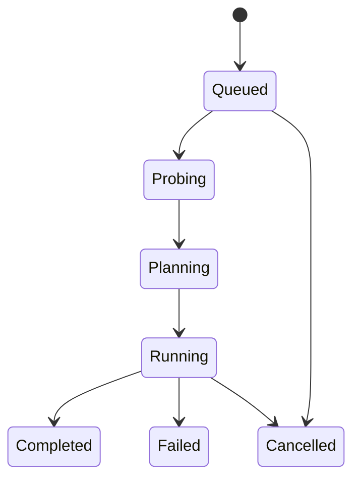

# Converting Files

This guide covers everything you need to know about converting media files with Honeymelon.

## Adding Files

There are multiple ways to add files to the conversion queue:

### Drag and Drop

The primary method for adding files is drag-and-drop:

1. Drag one or more media files from Finder
2. Drop them into the Honeymelon window
3. The app will analyze each file and suggest appropriate presets

::: tip Folder Support
You can also drag entire folders. Honeymelon will recursively discover all supported media files within the folder and add them to the queue.
:::

### File Picker

Alternatively, use the native file picker:

1. Click the "Add Files" button or press `Cmd + O`
2. Select one or more files in the dialog
3. Click "Open" to add them to the queue

## Understanding the Job Queue

Each file you add creates a **job** in the queue. Jobs progress through several states:

### Job States



- **Queued**: Waiting to be processed
- **Probing**: Analyzing file with FFprobe to extract metadata
- **Planning**: Determining optimal conversion strategy
- **Running**: Actively converting the file
- **Completed**: Successfully converted
- **Failed**: Error occurred during conversion
- **Cancelled**: User cancelled the job

## Conversion Workflow

### Step 1: Probing

When a job starts, Honeymelon uses FFprobe to analyze the source file:

- Extract video/audio codecs
- Determine resolution, frame rate, and bit depth
- Identify color space and HDR metadata
- Calculate duration and file size

This metadata is used to make intelligent decisions in the planning phase.

### Step 2: Planning

Based on the probe results and selected preset, Honeymelon generates a conversion plan:

#### Stream Actions

For each stream (video, audio), the planner determines one of three actions:

**Copy (Remux)**

- Used when the source codec is compatible with the target container
- No re-encoding, preserves original quality
- Extremely fast (typically 100-500+ fps)

**Transcode**

- Used when codecs are incompatible or quality tier requires it
- Re-encodes the stream with specified codec and settings
- Slower but allows format/quality changes

**Drop**

- Removes unwanted streams (e.g., duplicate audio tracks, subtitles)
- Configurable in preset definitions

#### Example Plans

**Remux Plan** (MKV with H.264 → MP4)

```

Video: H.264 → Copy (compatible with MP4)
Audio: AAC → Copy (compatible with MP4)
Result: Fast remux, no quality loss

```

**Transcode Plan** (MKV with VP9 → MP4)

```

Video: VP9 → Transcode to H.264 (VP9 not in MP4)
Audio: Opus → Transcode to AAC (Opus not in MP4)
Result: Full transcode required

```

### Step 3: Execution

Honeymelon spawns an FFmpeg process with the generated command:

```bash
ffmpeg -i input.mkv \
  -c:v libx264 -preset medium -crf 23 \
  -c:a aac -b:a 192k \
  output.mp4

```

Progress is tracked by parsing FFmpeg's stderr output:

- **Frame**: Current frame being encoded
- **FPS**: Encoding speed in frames per second
- **Time**: Current position in the media file
- **Bitrate**: Output bitrate
- **Speed**: Encoding speed relative to playback (e.g., "2.5x")

## Managing Jobs

### Before Starting

While a job is in the **Queued** state, you can:

- **Change Preset**: Select a different target format
- **Adjust Quality**: Switch between Fast, Balanced, and High tiers
- **Cancel**: Remove the job from the queue

### During Conversion

While a job is **Running**, you can:

- **Monitor Progress**: Watch real-time encoding statistics
- **View Logs**: Expand the job card to see detailed FFmpeg output
- **Cancel**: Stop the conversion (source file remains unchanged)

::: warning Cancelling Jobs
Cancelling a running job will delete any partially-converted output file. The original source file is never modified.
:::

### After Completion

Once a job reaches **Completed** or **Failed** state:

- **View Output**: Click to reveal the output file in Finder
- **Review Logs**: Check detailed conversion logs
- **Remove from Queue**: Clear the completed job from the list

## Output Files

### Output Location

By default, converted files are saved:

```

[source directory]/[filename]-converted.[extension]

```

For example:

```

Input:  ~/Videos/movie.mkv
Output: ~/Videos/movie-converted.mp4
```

You can configure the output directory in [Preferences](/guide/preferences).

### Output Naming

The `-converted` suffix prevents overwriting source files. You can customize this behavior in preferences:

- **Add Suffix**: Append `-converted` to filename (default)
- **Custom Suffix**: Use your own suffix (e.g., `-h264`, `-optimized`)
- **No Suffix**: Use original filename (risky - may overwrite!)

### Handling Name Conflicts

If an output file already exists, Honeymelon will:

1. Append a number to the filename (e.g., `-converted-1.mp4`)
2. Increment until a unique name is found
3. Never overwrite existing files

## Advanced Topics

### Concurrent Conversions

By default, Honeymelon processes 2 jobs simultaneously. This is configurable in [Preferences](/guide/preferences).

**Considerations:**

- **CPU Usage**: More concurrent jobs = higher CPU usage
- **Memory**: Each FFmpeg process consumes RAM
- **I/O**: Disk throughput may become a bottleneck
- **Thermal**: Apple Silicon Macs handle heat well, but watch temperatures

For 4K content or complex encoding, reduce concurrency to 1. For simple remux operations, you can safely increase to 4-6+.

### Stream Selection

Some advanced presets allow stream selection:

- **Video Track**: Choose primary video stream
- **Audio Track**: Select audio language/track
- **Subtitles**: Include or exclude subtitle streams

Currently, Honeymelon uses the default streams. Custom stream selection is planned for a future release.

### Metadata Preservation

Honeymelon preserves metadata where possible:

- **Container Metadata**: Title, creation date, etc.
- **Color Metadata**: Color space, primaries, transfer characteristics
- **HDR Metadata**: HDR10, Dolby Vision (when supported by codec)

Some metadata may be lost during transcoding depending on codec support.

## Common Scenarios

### Scenario 1: Convert for Web

**Goal**: Create a web-optimized MP4 from a large MOV file

1. Add the `.mov` file
2. Select `video-to-mp4` preset
3. Choose **Balanced** quality tier
4. Start conversion

Result: Smaller file size with good quality, compatible with all browsers.

### Scenario 2: Lossless Container Change

**Goal**: Convert MKV to MP4 without re-encoding

1. Add the `.mkv` file (ensure it contains H.264/AAC)
2. Select `video-to-mp4` preset
3. Choose **Fast** quality tier
4. Start conversion

Result: Near-instant remux with zero quality loss.

### Scenario 3: Batch Convert Folder

**Goal**: Convert all videos in a folder to H.265

1. Drag the entire folder into Honeymelon
2. All video files are added to the queue
3. Select `video-to-mkv` for each job
4. Choose **High** quality tier
5. Start all conversions

Result: Entire folder converted with maximum quality H.265 encoding.

### Scenario 4: Extract Audio

**Goal**: Extract audio from a video file

1. Add the video file
2. Select `audio-to-m4a` or `audio-to-flac` preset
3. Choose quality tier
4. Start conversion

Result: Audio-only file extracted from the video.

## Next Steps

- Learn about [Presets & Quality](/guide/presets) to understand conversion options
- Explore [Batch Processing](/guide/batch-processing) for efficient workflows
- Configure [Preferences](/guide/preferences) to customize behavior
