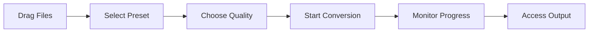

# Getting Started

This guide will help you get Honeymelon up and running on your Mac.

## Prerequisites

Before you begin, ensure your system meets the following requirements:

- **macOS 13.0 (Ventura) or later**
- **Apple Silicon processor** (M1, M2, M3, M4, or later)
- **4 GB RAM** minimum (8 GB recommended for 4K content)
- **~50 MB free disk space** for the application

::: warning Intel Macs Not Supported
Honeymelon is built exclusively for Apple Silicon Macs. If you have an Intel-based Mac, the application will not run.
:::

## Installation

### Option 1: Download Pre-built Binary

Grab the latest signed DMG from the [GitHub Releases](https://github.com/honeymelon-app/honeymelon/releases) page and drag `Honeymelon.app` into `/Applications`.

### Option 2: Build from Source

#### Step 1: Install Dependencies

First, you'll need to set up your development environment:

```bash
# Install Homebrew (if not already installed)
/bin/bash -c "$(curl -fsSL https://raw.githubusercontent.com/Homebrew/install/HEAD/install.sh)"

# Install Node.js (v18 or later)
brew install node

# Install Rust
curl --proto '=https' --tlsv1.2 -sSf https://sh.rustup.rs | sh
source $HOME/.cargo/env

# Verify installations
node --version
npm --version
cargo --version

```

#### Step 2: Clone the Repository

```bash
git clone https://github.com/honeymelon-app/honeymelon.git
cd honeymelon

```

#### Step 3: Install Node Dependencies

```bash
npm install

```

This will also automatically download FFmpeg binaries (or you can skip this by setting `SKIP_FFMPEG_DOWNLOAD=1`).

#### Step 4: Build the Application

```bash
# For development
npm run tauri:dev

# For production build
npm run tauri:build

```

The production build will create a `.dmg` file in `src-tauri/target/release/bundle/dmg/`.

## FFmpeg Setup

Honeymelon requires FFmpeg to perform media conversions. There are three ways to provide FFmpeg:

### Option 1: Bundled FFmpeg (Automatic)

The `npm install` step automatically downloads FFmpeg binaries and places them in `src-tauri/resources/bin/`. These binaries ship inside the Tauri bundle.

### Option 2: System FFmpeg

If you have FFmpeg installed on your system, Honeymelon can use it:

```bash
brew install ffmpeg

```

The application will automatically detect system FFmpeg if bundled binaries are not found.

### Option 3: Custom FFmpeg Path

Set the `HONEYMELON_FFMPEG_PATH` and `HONEYMELON_FFPROBE_PATH` environment variables (or configure the path inside Preferences) to point to custom FFmpeg builds.

## First Launch

When you first launch Honeymelon:

1. **Grant Permissions**: macOS may prompt you to allow the application to access files
2. **Check FFmpeg**: The app will verify FFmpeg availability on startup
3. **Set Preferences** (optional): Open Preferences to configure output directory and concurrency

::: tip
If you see a message about FFmpeg not being found, run `npm run download-ffmpeg` to repopulate `src-tauri/resources/bin/` or install FFmpeg via Homebrew and set `HONEYMELON_FFMPEG_PATH`.
:::

## Your First Conversion

Let's convert a video file to demonstrate the basic workflow:

### Step 1: Add a File

Drag and drop a video file (e.g., `.mov`, `.mkv`, or `.mp4`) into the Honeymelon window.

### Step 2: Select a Preset

The application will automatically suggest a preset based on the file type. Common presets include:

- `video-to-mp4` - Convert to MP4 container
- `video-to-mkv` - Convert to MKV container
- `video-to-webm` - Convert to WebM container

### Step 3: Choose Quality Tier

Select from three quality tiers:

- **Fast**: Prioritizes stream copying (remux) for maximum speed
- **Balanced**: Optimized bitrates with good quality/size ratio
- **High**: Maximum quality with higher bitrates

### Step 4: Start Conversion

Click the "Start" button (or use the keyboard shortcut). The job will enter the queue and begin processing.

### Step 5: Monitor Progress

Watch real-time progress with:

- Percentage complete
- Encoding speed (fps)
- Estimated time remaining
- Live log output

### Step 6: Access Output

Once complete, the converted file will be saved to your configured output directory (default: same directory as source file with `-converted` suffix).

## Basic Workflow



## Keyboard Shortcuts

- `Cmd + ,` - Open Preferences
- `Cmd + O` - Open file picker
- `Cmd + Q` - Quit application

## Next Steps

Now that you have Honeymelon running, explore these guides:

- [Converting Files](/guide/converting-files) - Detailed conversion workflows
- [Presets & Quality](/guide/presets) - Understanding presets and quality settings
- [Batch Processing](/guide/batch-processing) - Converting multiple files efficiently
- [Preferences](/guide/preferences) - Customizing the application

## Troubleshooting

If you encounter issues, see the [Troubleshooting Guide](/guide/troubleshooting) or check:

- FFmpeg is properly installed/bundled
- Input files are valid media files
- Sufficient disk space is available
- Your Mac meets the system requirements
