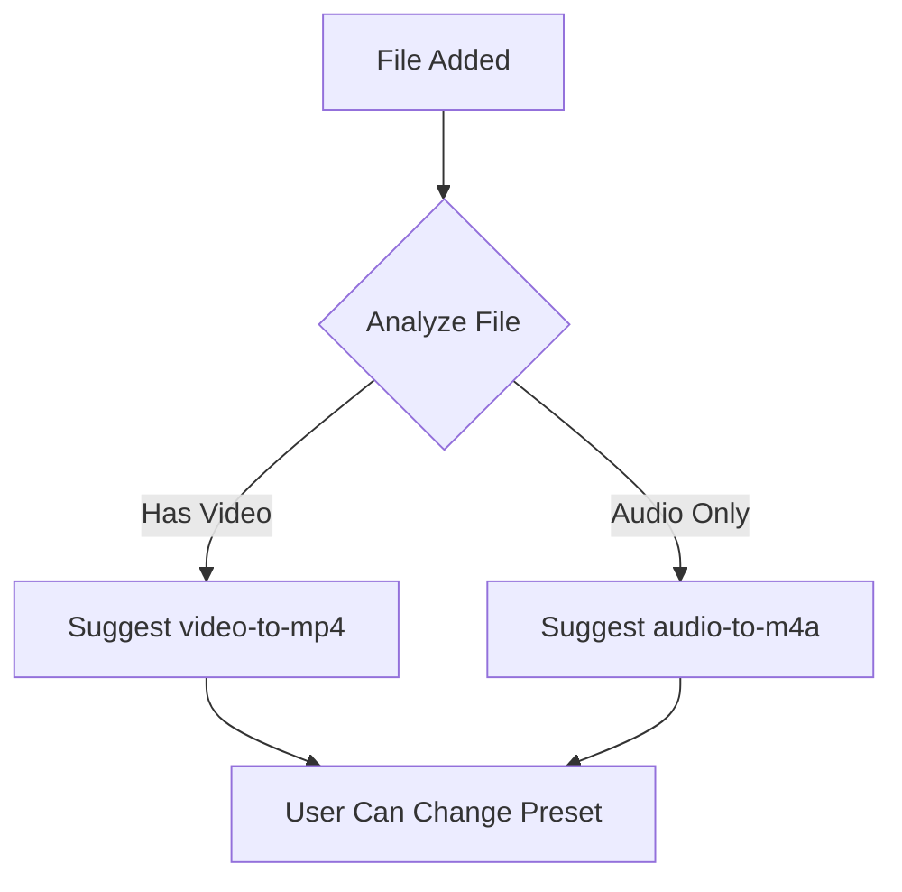
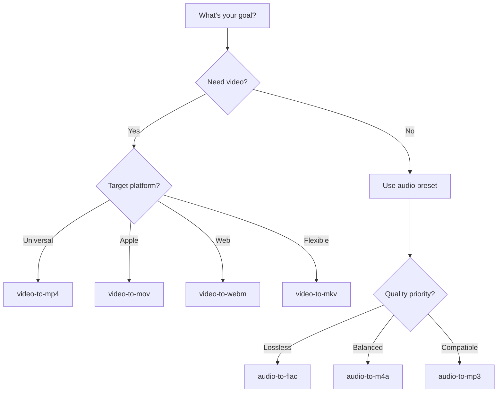

# Presets & Quality

Honeymelon uses a preset-based system to simplify media conversion. This guide explains how presets work and how to choose the right quality settings.

## What are Presets?

A **preset** defines the target format and conversion rules for a media file. Instead of manually configuring codecs, bitrates, and container formats, you simply select a preset like `video-to-mp4` or `audio-to-flac`.

### Dynamic Preset Generation

Honeymelon automatically generates presets for all valid source-to-target format combinations:

```typescript
// Example preset structure
{
  id: "video-to-mp4",
  label: "Video to MP4",
  sourceType: "video",
  targetContainer: "mp4",
  videoCodec: "h264",
  audioCodec: "aac"
}

```

This means you'll always have access to the right presets based on your file type.

## Preset Categories

### Video Presets

Convert video files to different container formats:

| Preset          | Target | Video Codec | Audio Codec | Use Case                |
| --------------- | ------ | ----------- | ----------- | ----------------------- |
| `video-to-mp4`  | MP4    | H.264       | AAC         | Universal compatibility |
| `video-to-mov`  | MOV    | H.264       | AAC         | Apple ecosystem         |
| `video-to-mkv`  | MKV    | H.265       | AAC         | High efficiency         |
| `video-to-webm` | WebM   | VP9         | Opus        | Web streaming           |
| `video-to-gif`  | GIF    | GIF         | None        | Animations, memes       |

### Audio Presets

Extract or convert audio streams:

| Preset          | Target | Audio Codec | Use Case                |
| --------------- | ------ | ----------- | ----------------------- |
| `audio-to-m4a`  | M4A    | AAC         | Universal compatibility |
| `audio-to-mp3`  | MP3    | MP3         | Legacy support          |
| `audio-to-flac` | FLAC   | FLAC        | Lossless archival       |
| `audio-to-wav`  | WAV    | PCM         | Uncompressed audio      |

## Quality Tiers

Each preset supports three quality tiers that control encoding parameters:

### Fast (Copy-Prioritized)

**Philosophy**: Preserve quality and maximize speed through remuxing.

**Behavior**:

- Copies streams whenever possible (no re-encoding)
- Only transcodes when absolutely necessary
- Uses faster encoder presets when transcoding is required

**Encoding Settings**:

- Video: CRF 23, preset `fast`
- Audio: 192 kbps

**Best For**:

- Container format changes (MKV → MP4)
- When source quality is already optimal
- Quick conversions where speed matters
- Preserving original encode settings

**Example**:

```

Source: video.mkv (H.264 + AAC)
Target: video-to-mp4 (Fast)
Result: Remux (copy both streams) - 500+ fps

```

### Balanced (Optimized)

**Philosophy**: Good quality with reasonable file sizes and encoding time.

**Behavior**:

- Uses optimized bitrates and encoder settings
- Balances quality, size, and speed
- Suitable for most general-purpose conversions

**Encoding Settings**:

- Video: CRF 23, preset `medium`
- Audio: 192 kbps

**Best For**:

- General-purpose conversions
- Web uploads (YouTube, Vimeo)
- Sharing files with others
- Reducing file sizes while maintaining quality

**Example**:

```

Source: video.mov (ProRes + PCM)
Target: video-to-mp4 (Balanced)
Result: Transcode to H.264/AAC - 30-60 fps

```

### High (Maximum Quality)

**Philosophy**: Preserve maximum quality regardless of file size or encoding time.

**Behavior**:

- Uses higher bitrates and slower encoder presets
- Prioritizes quality over all other factors
- Produces larger files with longer encoding times

**Encoding Settings**:

- Video: CRF 18, preset `slow`
- Audio: 256 kbps

**Best For**:

- Archival purposes
- Professional video editing workflows
- When quality is paramount
- Creating master copies

**Example**:

```

Source: video.mov (4K ProRes)
Target: video-to-mkv (High)
Result: H.265 with high bitrate - 10-20 fps

```

## Understanding CRF (Constant Rate Factor)

CRF is the quality control parameter for video encoding:

- **Lower CRF = Higher Quality = Larger Files**
- **Higher CRF = Lower Quality = Smaller Files**

| CRF Value | Quality    | Typical Use            |
| --------- | ---------- | ---------------------- |
| 15-18     | Excellent  | Archival, professional |
| 19-23     | Good       | General purpose        |
| 24-28     | Acceptable | Web streaming          |
| 29+       | Poor       | Not recommended        |

Honeymelon uses:

- **Fast**: CRF 23
- **Balanced**: CRF 23
- **High**: CRF 18

::: tip
CRF 23 is FFmpeg's recommended default for H.264 encoding, providing good quality at reasonable file sizes.
:::

## Preset Selection Logic

When you add a file, Honeymelon suggests a preset based on the file type:



You can always change the preset before starting the conversion.

## Codec Compatibility

Understanding codec compatibility helps predict whether Honeymelon will remux or transcode:

### MP4 Container

**Compatible Codecs**:

- Video: H.264, H.265 (HEVC)
- Audio: AAC, MP3

**Incompatible** (requires transcode):

- Video: VP9, VP8, AV1, ProRes
- Audio: Opus, Vorbis, FLAC, PCM

### MKV Container

**Compatible Codecs**:

- Video: Almost all (H.264, H.265, VP9, AV1, ProRes)
- Audio: Almost all (AAC, MP3, Opus, FLAC, PCM)

MKV is the most flexible container and rarely requires transcoding.

### WebM Container

**Compatible Codecs**:

- Video: VP8, VP9, AV1
- Audio: Opus, Vorbis

**Incompatible**:

- Video: H.264, H.265, ProRes
- Audio: AAC, MP3

### MOV Container

**Compatible Codecs**:

- Video: H.264, H.265, ProRes
- Audio: AAC, PCM

Similar to MP4 but with better support for professional codecs like ProRes.

## Hardware Acceleration

Honeymelon automatically uses Apple VideoToolbox for hardware-accelerated encoding when:

- Target codec is H.264 or H.265
- Running on Apple Silicon Mac
- Software encoder is libx264 or libx265

**Benefits**:

- 2-5x faster encoding on supported codecs
- Reduced CPU usage
- Lower power consumption

**Limitations**:

- Quality may be slightly lower than software encoding
- Some advanced features not available (e.g., custom tune settings)

::: info
Hardware acceleration is automatically selected. No configuration required!
:::

## Custom Presets (Future)

Currently, Honeymelon uses predefined presets. Future versions will support:

- Custom preset creation
- Preset templates
- Per-codec configuration
- Advanced stream mapping
- Filter chains (crop, scale, denoise)

## Choosing the Right Preset

### Decision Tree



### Common Scenarios

**Scenario: Convert for iPhone/iPad**

- Preset: `video-to-mp4` or `video-to-mov`
- Quality: Balanced or High
- Reason: Native format for iOS devices

**Scenario: Upload to YouTube**

- Preset: `video-to-mp4`
- Quality: Balanced
- Reason: YouTube recommends H.264/AAC in MP4

**Scenario: Archival Storage**

- Preset: `video-to-mkv`
- Quality: High
- Reason: Flexible container with high-quality H.265

**Scenario: Quick Container Change**

- Preset: Any matching source codecs
- Quality: Fast
- Reason: Remux without transcoding

**Scenario: Extract Lossless Audio**

- Preset: `audio-to-flac`
- Quality: Any (lossless by default)
- Reason: No quality loss from original

## Next Steps

- Learn about [Converting Files](/guide/converting-files) for detailed workflows
- Explore [Batch Processing](/guide/batch-processing) for efficient multi-file conversion
- Understand the [Conversion Pipeline](/architecture/pipeline) architecture
